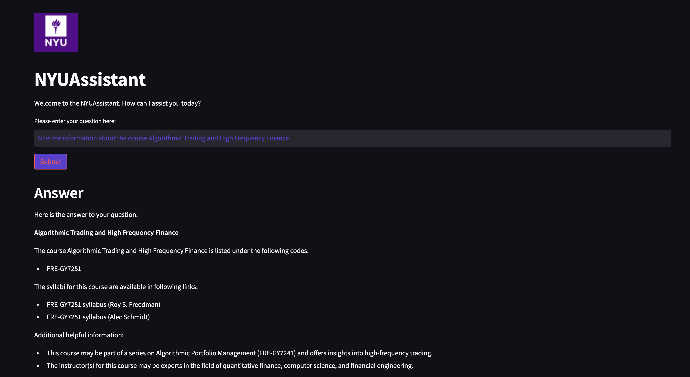

# NYU-Assistant

This project develops a Retrieval-Augmented Generation (RAG) system tailored for the NYU community to effectively address and answer various inquiries. Combining advanced NLP techniques and modern web technologies, the system enhances information access and user interaction by providing accurate, AI-generated responses based on up-to-date data scraped from NYU resources.

## Key Features

- **Information Extraction**: Implements scraping techniques to systematically gather and update content from NYU websites, ensuring the database remains current with the latest information.
- **Enhanced Data Retrieval**: Utilizes instructor embeddings to compute text embeddings, stored in a FAISS vector database, which significantly speeds up data retrieval and improves the accuracy of the query responses.
- **Reranking with FlashRank**: Integrates FlashRank to rerank retrieved data, optimizing performance and ensuring the most relevant information is presented to the user.
- **Advanced NLP Pipeline**: Leverages LangChain and llama3-8b to construct robust natural language processing workflows, enabling the system to generate precise and contextually relevant answers.
- **Interactive Web Application**: Developed using Streamlit, the web application provides a user-friendly interface that allows NYU community members to interact with the system in real-time, enhancing user engagement and overall system functionality.

## Technologies Used

- **Data Scraping and Processing**: Custom scraping techniques
- **Text Embedding and Storage**: Instructor embeddings, FAISS vector database
- **Reranking**: FlashRank
- **Natural Language Processing**: LangChain, llama3-8b
- **Web Application**: Streamlit

## Project Impact

This RAG system serves as a critical tool for the NYU community, offering an efficient and intuitive means to access information. By automating response generation and optimizing data retrieval, the system not only saves time but also ensures that the users receive the most relevant and accurate information, thereby enhancing the overall educational and administrative experience at NYU.

## Demo

When tested, the RAG system generates factually accurate responses to questions related to NYU.

